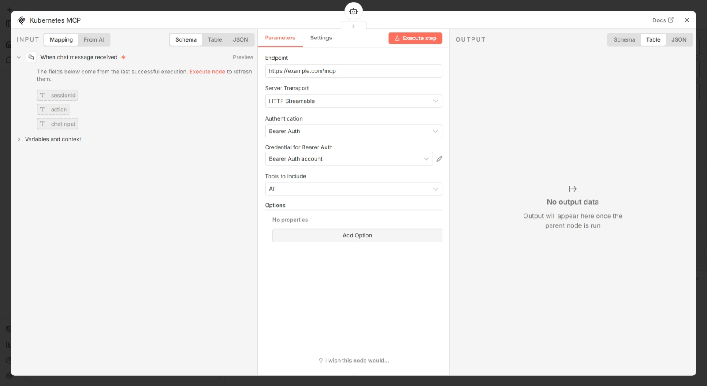

# Requirements

- Finish [Install n8n](./install-n8n.md)
- Finish [Create GitHub API Key for n8n](./create-github-api-key-for-n8n.md)
- Finish [Create Gemini API Key for n8n](./create-gemini-api-key-for-n8n.md)
- Finish [Install Kubernetes MCP](./install-kubernetes-mcp.md)

# Create an Advanced n8n Workflow

1. Click the three-dot menu button on the top-left corner

2. Click "**Import from file**"

3. Upload the [exia-devops-assistant.json](../n8n-workflows/exia-devops-assistant.json) workflow file

4. Double-click "Google Gemini Chat Model"

5. Click "**+ Create new credential**"

6. Fill in your saved Gemini "**API Key**"

7. Click "**Save**" and back to canvas

8. Double-click "**GitHub Action MCP**"

9. Click "**+ Create new credential**"

10. Fill in your saved GitHub "**Bearer Token**"

11. Click "**Save**" and back to canvas

12. Double-click "**Kubernetes MCP**"

13. Set up the endpoint and authentication if needed

12. Continue to [Advanced Test](./testing-advanced.md)
