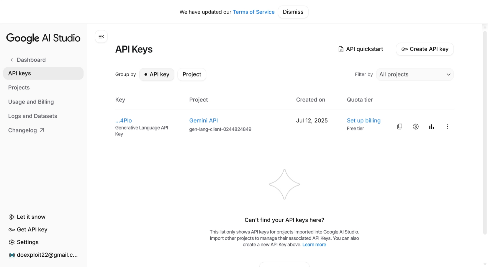
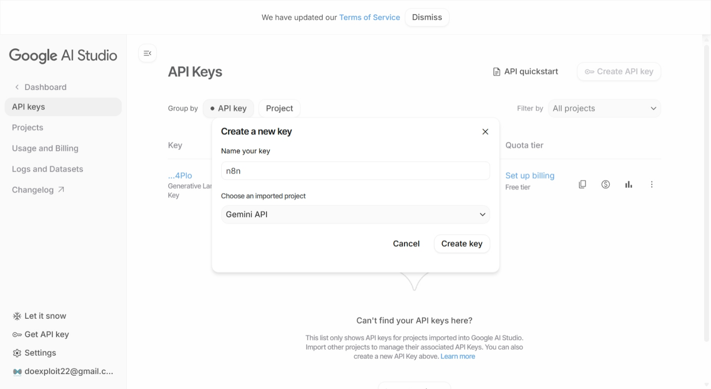

# Requirements

- You must have a [Google account](https://accounts.google.com/)

# Create a Gemini API Key for n8n

1. Open https://aistudio.google.com/

2. Click "**🔑 Create API key**"

3. Give your key a name. If you don't have a Gemini project yet, create one first

4. Click "**Create key**"

5. Save the key. You will need it when you create the n8n workflow
