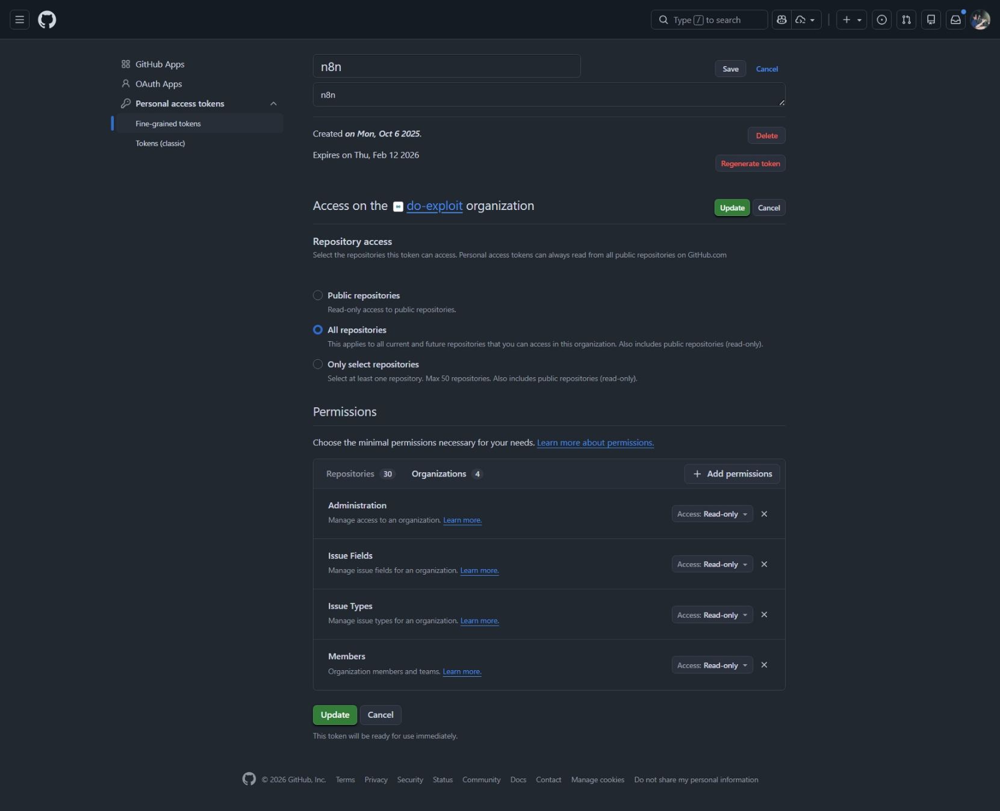

# Requirements

- You must have a [GitHub account](https://docs.github.com/en/get-started/start-your-journey/creating-an-account-on-github)

# Create a GitHub API Key for n8n

1. Open https://github.com/settings/personal-access-tokens and choose "**Fine-grained tokens**"

2. Click "**Generate new token**"

3. Use these permission settings:

4. Click "**Generate token**"

5. Save the key. You will need it when you create the n8n workflow
