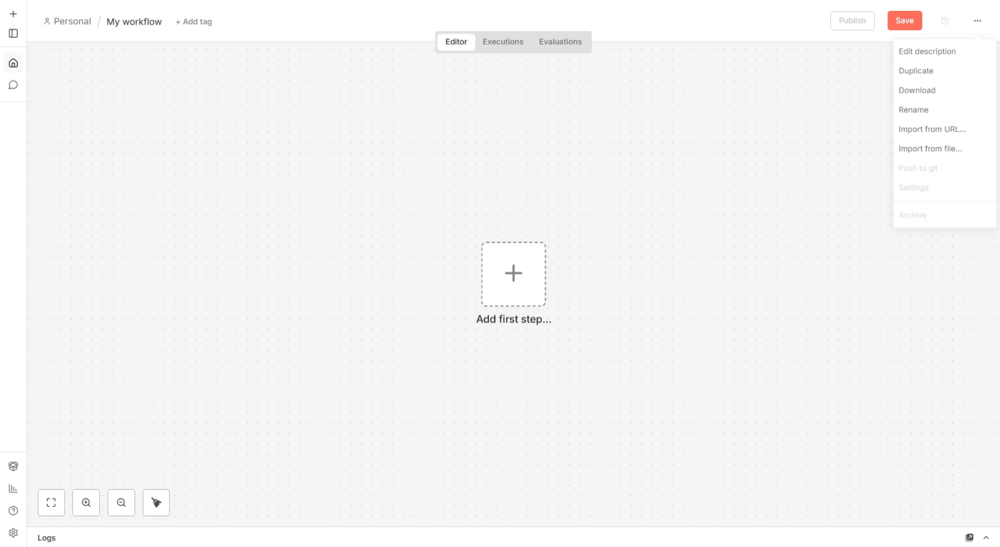
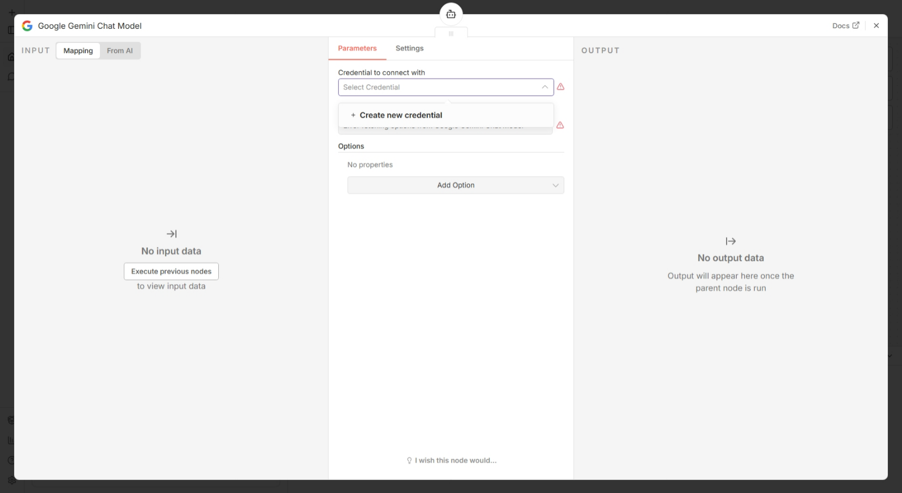
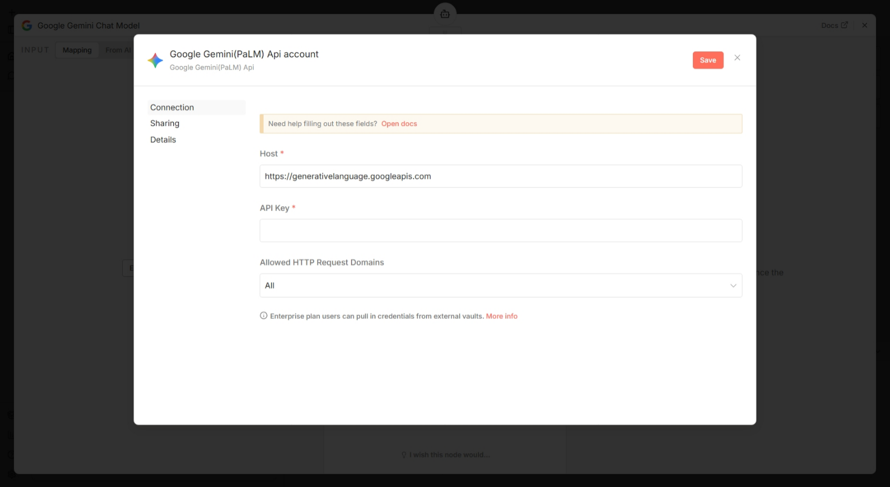
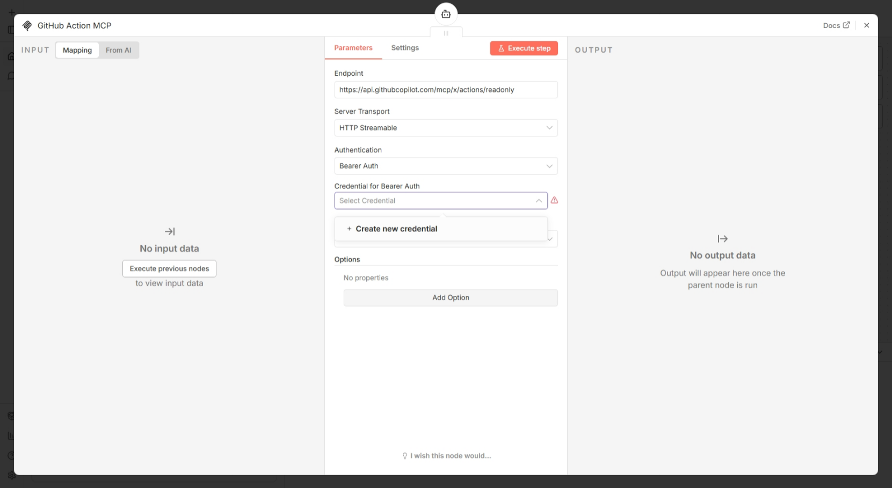
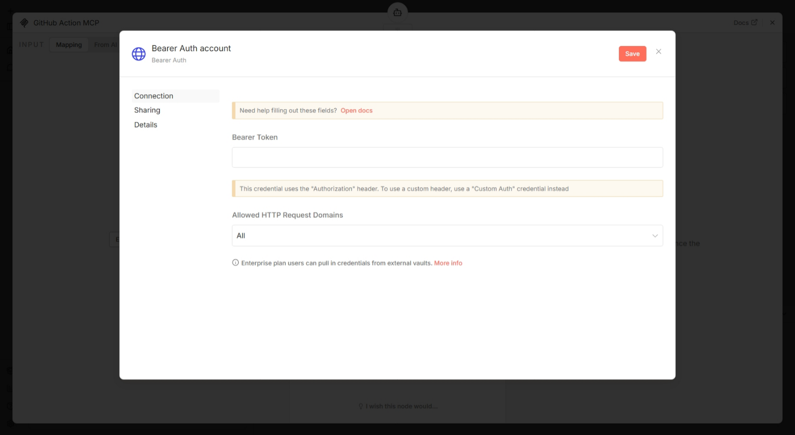
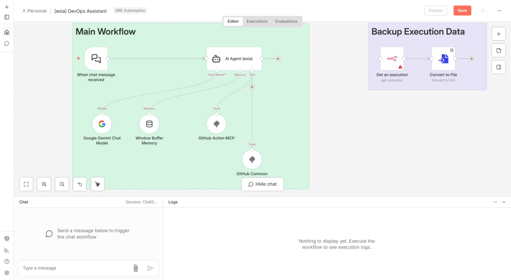

# Requirements

- Finish [Install n8n](./install-n8n.md)
- Finish [Create GitHub API Key for n8n](./create-github-api-key-for-n8n.md)
- Finish [Create Gemini API Key for n8n](./create-gemini-api-key-for-n8n.md)

# Create a Simple n8n Workflow

1. Click the three-dot menu button on the top-left corner

2. Click "**Import from file**"

3. Upload the [exia-devops-assistant.json](../n8n-workflows/exia-devops-assistant.json) workflow file

4. Remove "**Kubernetes MCP**" node

5. Double-click "Google Gemini Chat Model"

6. Click "**+ Create new credential**"

7. Fill in your saved Gemini "**API Key**"

8. Click "**Save**" and back to canvas

9. Double-click "**GitHub Action MCP**"

10. Click "**+ Create new credential**"

11. Fill in your saved GitHub "**Bearer Token**"

12. Click "**Save**" and back to canvas

13. Continue to [Simple Test](./testing-simple.md)
