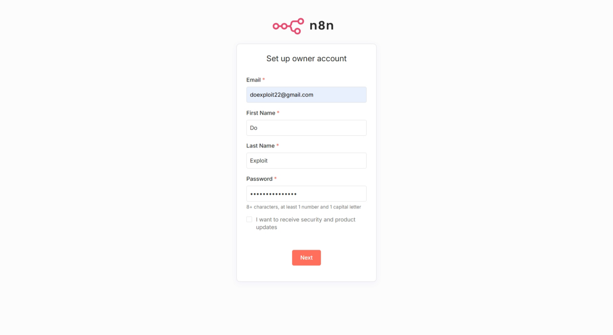
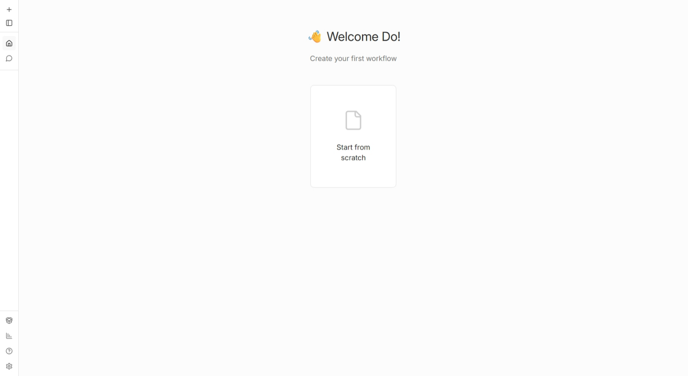

# Requirements

- Docker - [Installation Guide](https://docs.docker.com/engine/install/)

# Install n8n

1. Clone the repository and start the services:

```bash
git clone https://github.com/do-exploit/exia
cd exia/n8n-workflows/
docker compose up -d
```

2. Open http://localhost:5678/setup in your browser

3. Fill in your email, name, and password to create your account



4. Click "**Start from scratch**"



6. Continue to the one of the following:

  - Create [simple n8n workflow](./create-simple-n8n-workflow.md)
  - Create [advanced n8n workflow](./create-advanced-n8n-workflow.md)
