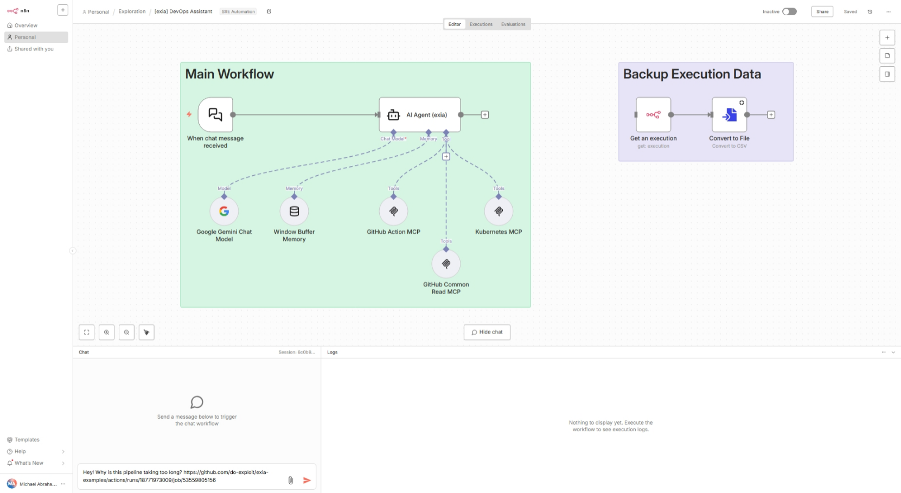

# Requirements

1. [Create a Gemini API Key for n8n](./create-gemini-api-key-for-n8n.md)
2. [Create GitHub Organization](./create-github-organization.md)
3. [Fork do-exploit/exia-examples to Your Organization](./fork-exia-examples-to-your-organization.md)
4. [Create a GitHub API Key for Self-hosted GitHub Actions](./create-github-api-key-for-self-hosted-github-actions.md)
5. [Create a GitHub API Key for n8n](./create-github-api-key-for-n8n.md)
6. [Install Kubernetes (Microk8s)](./install-kubernetes-microk8s.md)
7. [Install Kubernetes MCP](./install-kubernetes-mcp.md)
8. [Install GitHub Runner (Self-hosted)](./install-github-runner-self-hosted.md)
9. [Install n8n](./install-n8n.md)
10. [Create an Advanced n8n Workflow](./create-advanced-n8n-workflow.md)

# Advanced Test

1. Clone the repository:

```bash
git clone https://github.com/do-exploit/exia
cd exia/test-evaluation/
```
2. Check available branches: https://github.com/do-exploit/exia-examples/branches/all

3. Run the workflow:

```bash
./trigger-workflow.sh <branch-name>

# Example
./trigger-workflow.sh training/case-1
```

4. Back to n8n canvas, and ask question like below on chat box:

```
Hey! Why is this pipeline taking too long? https://github.com/do-exploit/exia-examples/actions/runs/18771973009/job/53559805156
```


