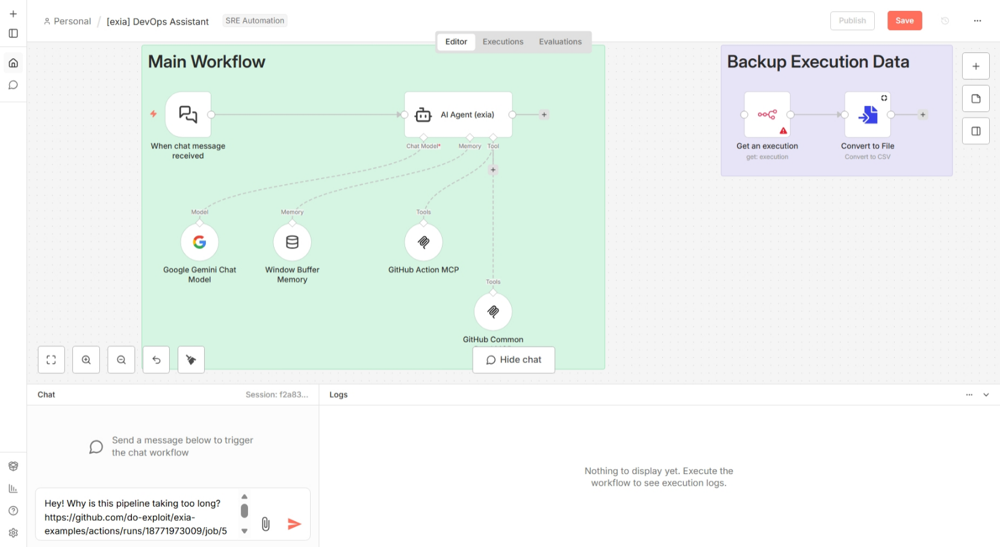

# Requirements

- Finish [Install n8n](./install-n8n.md)
- Finish [Create GitHub API Key for n8n](./create-github-api-key-for-n8n.md)
- Finish [Create Gemini API Key for n8n](./create-gemini-api-key-for-n8n.md)
- Finish [Create Simple n8n Workflow](./create-simple-n8n-workflow.md)

# Simple Test

1. Open https://github.com/do-exploit/exia-examples/actions

2. Choose one of workflow runs you want exia to investigate

3. Back to n8n canvas, and ask question like below on chat box:

```
Hey! Why is this pipeline taking too long? https://github.com/do-exploit/exia-examples/actions/runs/18771973009/job/53559805156
```


